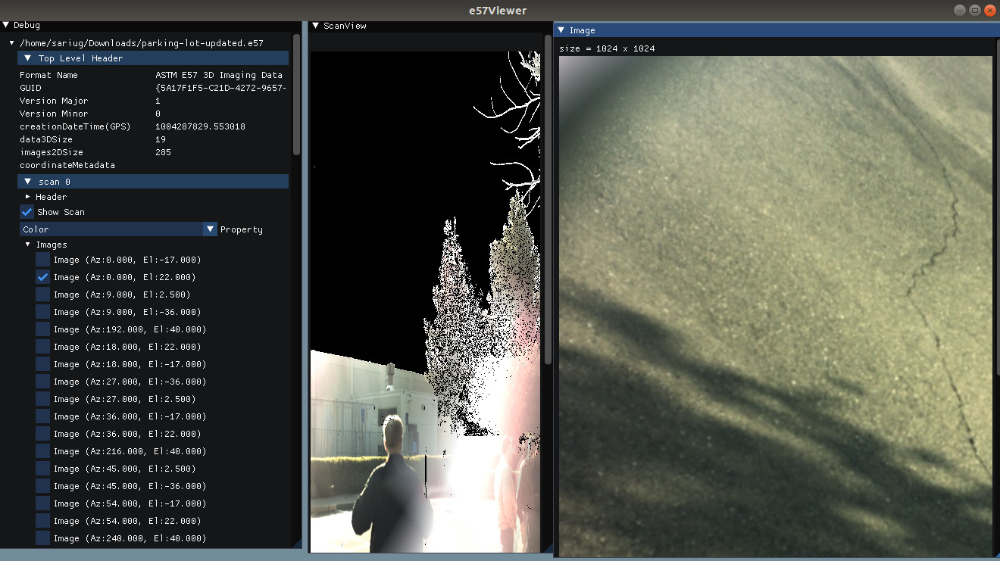

# E57Viewer

A quick E57 reader implementation for inspecting the data and visualizing the structered scans as well as images.

I prepared this small code really quickly to test out some E57 functionality and to understand the file type better. There are possible many bugs. 

## Installation

Clone the repository including submodules and build it. I just worked on ubuntu up to know. Not sure what would happen for the other operating systems.

## Usage

Drag and drop the E57 file. Start inspecting.

## Contributing
Let me know if you want to add something or thinking that you may use it and a bug is creating problem. I will fix in happily :) 

## License
[MIT](https://choosealicense.com/licenses/mit/)